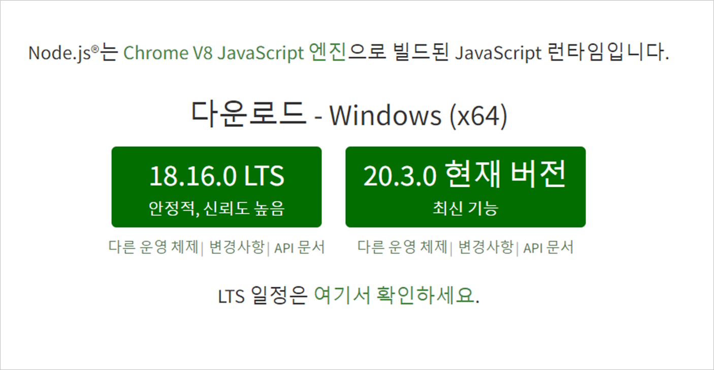

# Chapter 01

> 자바스크립트에서 타입스크립트로
> 

## 1. Typescript 시작

1) Node 및 npm 설치 : [https://nodejs.org/ko](https://nodejs.org/ko)

2) 설치 확인

node -v		: Node 버전 확인

npm -v		: npm 버전 확인

3) Node 프로젝트 시작

npm init -y

<aside>
💡 **npm init -y**

: package.json 파일이 생성된다.

</aside>

<aside>
💡 **package.json**

: node 프로젝트의 설정 정보가 담긴 파일

</aside>

4) Typescript 프로젝트 시작

npm i typescript

<aside>
💡 **node_modules**

: typescript 라이브러리가 있는 디렉토리

</aside>

<aside>
💡 **package-lock.json**

</aside>

5) tsc 시작

npx tsc --init

<aside>
💡 **tsconfig.json**

: npx tsc –-init으로 생성된다.

: Typescript가 코드를 분석할 때 사용하는 설정파일

</aside>

6) 타입스크립트 코드 분석

npx tsc		: 전체 코드 분석

npx tsc (파일)	: 특정파일 코드 분석